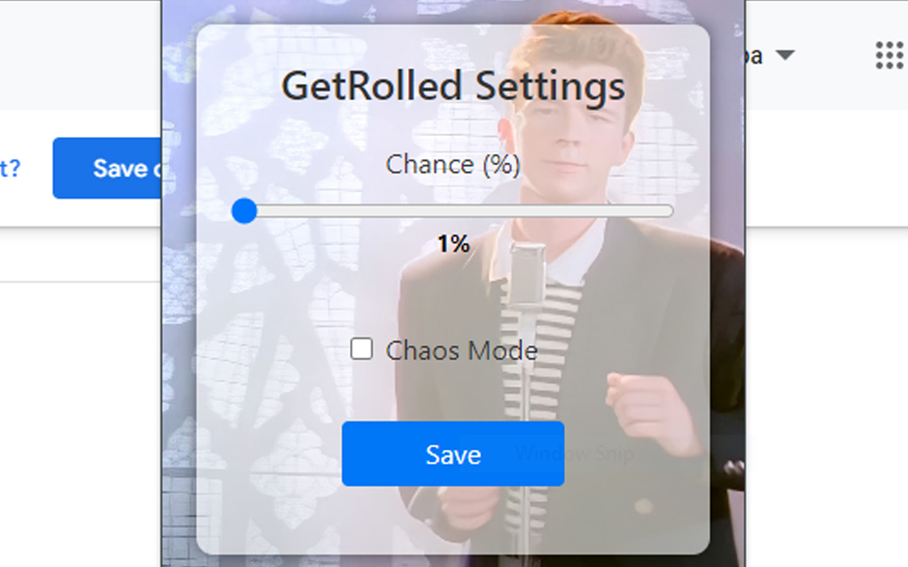

#  GetRolled 

GetRolled is a browser extension designed to add a playful twist to your browsing experience. With GetRolled, you can surprise yourself or your friends with classic Rickroll moments, injecting a bit of fun and mischief into your day.

## Features

- **Customizable Chance**: Adjust the likelihood of getting Rickrolled by setting a custom chance percentage.
- **Single Purpose**: GetRolled focuses solely on adding a surprise element to your browsing, keeping things simple and straightforward.
- **Chaos Mode**: Enabling Chaos Mode to have EVERY request have a chance to open a new RickRoll tab, as youtube has a lot of request this will soon flood the browser (as of this moment it's capped at 20% chance to keep everyones sanity).

## Installation

Install from the Chrome WebStore:
[GetRolled](https://chromewebstore.google.com/detail/getrolled/bpdmhoamecncgcdabnglkinmamlkkfnf)

Install from the github:

1. Download the latest release from the [Releases](https://github.com/yourusername/GetRolled/releases) page.
2. Unzip the downloaded file.
3. Open your browser's extension settings.
4. Enable Developer Mode.
5. Click on "Load unpacked" and select the unzipped folder.

That's it! GetRolled is now ready to surprise you with unexpected Rickroll moments.

## Usage

Adjust the chance percentage to customize the frequency of Rickroll surprises. Toggle Chaos Mode on or off.  Sit back, relax, and let GetRolled add a touch of fun to your (or someone else's) browsing experience!

## Contributing

Contributions are welcome! If you have any ideas for new features, improvements, or bug fixes, feel free to open an issue or submit a pull request.
